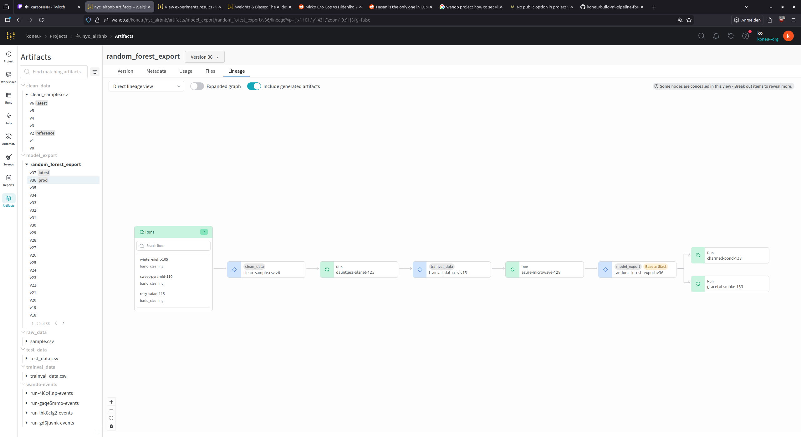

# wandb project

https://wandb.ai/koneu-/nyc_airbnb

## Lineage graph



sadly i could not find better parameters, than the default parameters already present in config.yml.

---

## Environment managers

Both **pixi** and **conda** are supported. The pipeline auto-detects which to use.

### pixi (default)
```bash
pixi run run
```

### conda
```bash
conda env create -f conda.yml
conda activate components
mlflow run . --env-manager=conda
```

---

## Known issues / gotchas

### NumPy 2.0 reshape fix
`np.reshape` dropped the `newshape=` keyword in NumPy 2.0. The `FunctionTransformer` in `train_random_forest` was updated to use a lambda instead. Any model artifact serialized **before** this fix needs to be **retrained** — otherwise `test_regression_model` will fail with a `TypeError`.

### sklearn version must match between train and test
A mismatch causes dtype errors when unpickling the pipeline. Both `train_random_forest` and `test_regression_model` conda envs are pinned to `scikit-learn=1.8.0`.

### `test_regression_model` requires a `prod` artifact
Promote a `random_forest_export` run to `prod` in W&B before running this step, otherwise the step is skipped with a warning.